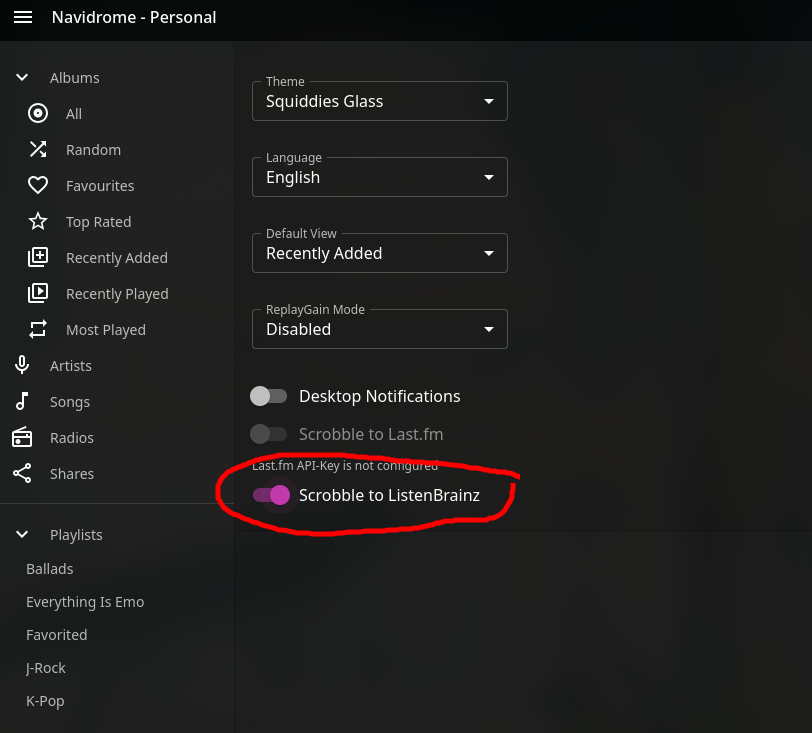

## Configure Koito
This quickstart assumes you are using Docker compose. Below is an example file, adjusted from the actual file I use personally.
```yaml title="compose.yaml"
services:
  koito:
    image: gabehf/koito:latest
    container_name: koito
    depends_on:
      - db
    user: 1000:1000
    environment:
      - KOITO_DATABASE_URL=postgres://postgres:<a_super_random_string>@db:5432/koitodb
      - KOITO_ALLOWED_HOSTS=koito.mydomain.com,192.168.1.100
      - KOITO_SUBSONIC_URL=https://navidrome.mydomain.com # the url to your navidrome instance
      - KOITO_SUBSONIC_PARAMS=u=<navidrome_username>&t=<navidrome_token>&s=<navidrome_salt>
      - KOITO_DEFAULT_THEME=black # i like this theme, use whatever you want
    ports:
      - "4110:4110"
    volumes:
      - ./koito-data:/etc/koito
    restart: unless-stopped

  db:
    user: 1000:1000
    image: postgres:16
    container_name: psql
    restart: unless-stopped
    environment:
      POSTGRES_DB: koitodb
      POSTGRES_USER: postgres
      POSTGRES_PASSWORD: <a_super_random_string>
    volumes:
      - ./db-data:/var/lib/postgresql/data
```

### How do I get the Subsonic params?
The easiest way to get your Subsonic parameters to open your browser and sign into Navidrome, then press F12 to get to
the developer options and navigate to the **Network** tab. Find a `getCoverArt` request (there should be a lot on the home
page) and look for the part of the URL that looks like `u=<username>&t=<random_string>&s=<small_random_string>`. This
is what you need to copy and provide to Koito.
:::note
If you don't want to use Navidrome to provide images to Koito, you can skip the `KOITO_SUBSONIC_URL` and `KOITO_SUBSONIC_PARAMS`
variables entirely.
:::

## Configure Navidrome
You have to provide Navidrome with the environment variables `ND_LISTENBRAINZ_ENABLED=true` and
`ND_LISTENBRAINZ_BASEURL=<your_koito_url>/apis/listenbrainz/1`. The place where you edit these environment variables will change
depending on how you have chosen to deploy Navidrome.

## Enable ListenBrainz in Navidrome
In Navidome, click on **Settings** in the top right, then click **Personal**.

Here, you will see that **Scrobble to ListenBrainz** is turned off. Flip that switch on.


When you flip it on, Navidrome will prompt you for a ListenBrainz token. To get this token, open your Koito page and sign in.
Press the settings button (or hit `\`) and go to the **API Keys** tab. Copy the autogenerated API key by either clicking the
copy button, or clicking on the key itself and copying with ctrl+c.

After hitting **Save** in Navidrome, your listen activity will start being sent to Koito as you listen to tracks. 

Happy scrobbling!
